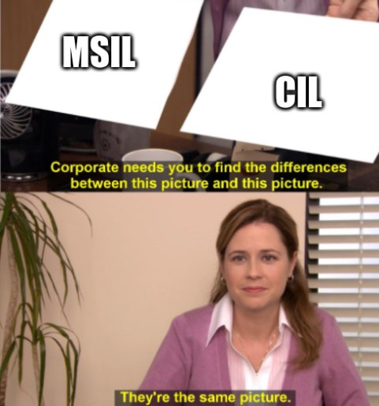

There can be confusion around Microsoft naming sometimes. So in this short post, I want to discuss the difference between CIL, MSIL, and IL.

*Disclaimer: they represent the same thing. And I couldn't find a clear answer in Microsoft documentation on what term to use.*

First, let us decrypt acronyms:
- CIL is Common Intermediate Language
- IL is Intermediate Language
- MSIL is Microsoft Intermediate Language

What is the difference between CIL, IL, and MSIL? According to [this](https://docs.microsoft.com/en-us/dotnet/standard/managed-code) article, it's the same thing, - "Intermediate Language is sometimes also called Common Intermediate Language (CIL) or Microsoft Intermediate Language (MSIL)".

You can think that may be one of them is outdated, but all are three used in Microsoft documentation right now:
- ["IL" - 1341 results](https://docs.microsoft.com/en-us/search/?terms=il)
- ["MSIL" - 822 results](https://docs.microsoft.com/en-us/search/?terms=msil)
- ["CIL" - 171 results](https://docs.microsoft.com/en-us/search/?terms=cil)

What is IL\CIL\MSIL? It's the result of managed code compilation. The CIL is platform and processor independent, and it is up to the CLR to JIT the IL\CIL\MSIL code into native code specific to the hardware. The CIL and CLR make up the CLI (Common Language Infrastructure). 

__*You can subscribe to my [Telegram channel](https://t.me/dotnetarticles), where I post interesting .NET-related stuff and tech news.*__

## What to read
- https://github.com/microsoft/CLRInstrumentationEngine/wiki/FAQ
- https://docs.microsoft.com/en-us/dotnet/standard/managed-code