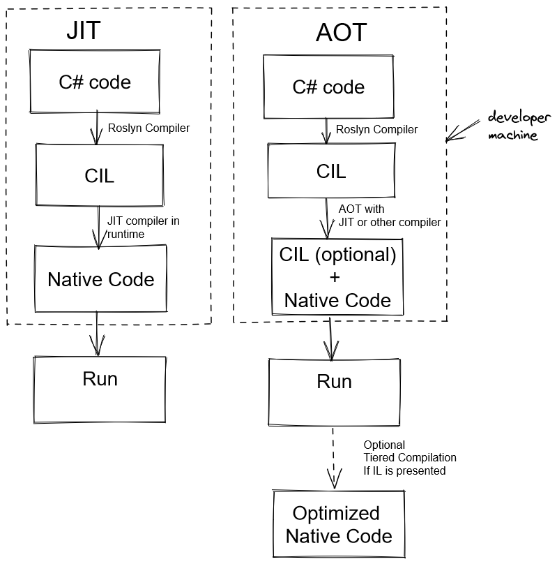

## Table of Contents
- [What is AOT](#what-is-aot)
  - [AOT vs JIT compilation](#aot-vs-jit-compilation)
  - [When you can benefit from AOT](#when-you-can-benefit-from-aot)
- [Ahead-of-Time tools and approaches](#ahead-of-time-tools-and-approaches)
- [Native AOT](#native-aot)
- [Let's try Native AOT in console](#lets-try-native-aot-in-console)
  - [Setup .NET 7 and create a sample console project on Windows](#setup-net-7-and-create-a-sample-console-project-on-windows)
  - [Sample console applications measurements](#sample-console-applications-measurements)
- [Let's try Native AOT in AWS Cloud](#lets-try-native-aot-in-aws-cloud)
  - [Setup .NET 7 and create a sample AWS Lambda on Amazon Linux 2 in WSL](#setup-net-7-and-create-a-sample-aws-lambda-on-amazon-linux-2-in-wsl)
  - [Deploy Lambdas and Compare their execution](#deploy-lambdas-and-compare-their-execution)
- [What to read](#what-to-read)

This post was inspired by the latest news about [Native AOT being the part of .NET 7](https://devblogs.microsoft.com/dotnet/announcing-dotnet-7-preview-3/#faster-lighter-apps-with-native-aot). So I decided to summarize past and current state of ahead-of-time compilation in dotnet ecosystem.

## What is AOT
When we talk about ahead-of-time (AOT) compilation, we usually mean tools that allow us to generate native code in build-time instead of runtime ([JIT compilation](https://en.wikipedia.org/wiki/Just-in-time_compilation)). AOT binaries will be larger because they contain not only native code but an IL code too.

### AOT vs JIT compilation
JIT executes on the end-user/server machine, and AOT usually (ngen.exe is an exception, for example) runs on the developer machine after Roslyn compilation.



### When you can benefit from AOT
- it helps to improve startup performance. 
- it can [produces libraries](https://github.com/dotnet/samples/blob/main/core/nativeaot/NativeLibrary/README.md) that can be consumed by programs written in programming languages that don't use CLR.
- it can be used on the platform where JIT, for some reason, is not allowed. For example, [Xamarin.iOS uses ahead-of-time compilation](https://docs.microsoft.com/en-us/xamarin/ios/internals/architecture#aot) because of security restrictions iOS has. Apple doesn't allow the execution of dynamically generated code on iOS.

## Ahead-of-Time tools and approaches
- [ReadyToRun (R2R)](https://docs.microsoft.com/en-us/dotnet/core/deploying/ready-to-run) - current mainstream approach for AOT compilation in dotnet. It describes an assembly format that contains IL + native code. In .NET 6.0 its performance was improved with Composite R2R Compilation. This feature allows cross-assembly optimization, such as the inlining method from another assembly. ReadyToRun supports cross-compilation.
- [mono AOT](https://www.mono-project.com/docs/advanced/aot/) - supports several modes: full and partial AOT. Full AOT for systems where JIT can't be run.
- [crossgen tool](https://github.com/dotnet/runtime/blob/main/docs/workflow/building/coreclr/crossgen.md) - later it was replaced with crossgen2.
- [crossgen2 tool](https://devblogs.microsoft.com/dotnet/announcing-net-6-preview-1/#crossgen2) - can generate assemblies in ReadyToRun format. It is the second version of the crossgen tool that the .NET team rewrote in C#. Crossgen2 has added features, such as [version bubbles](https://github.com/dotnet/runtime/blob/main/docs/design/features/crossgen2-compilation-structure-enhancements.md). The crossgen2 architecture uses a graph that allows performing different analysis and optimizations. There is great [article](https://devblogs.microsoft.com/dotnet/conversation-about-crossgen2/) that discusses crossgen2.
- [ngen.exe](https://docs.microsoft.com/en-us/dotnet/framework/tools/ngen-exe-native-image-generator) - for .Net framework. It runs on the target machine and produces executables that are not self-contained and requires an installed runtime. Can cause some [performance issues](https://devblogs.microsoft.com/dotnet/wondering-why-mscorsvw-exe-has-high-cpu-usage-you-can-speed-it-up/) on target PC.
- [CoreRT](https://github.com/dotnet/corert) - .NET Core runtime optimized for ahead-of-time compilation. Right now, this project has been replaced by Native AOT. It could use not only JIT compiler but experimental projects, like IL to CPP. It generates one file containing the app itself, its dependencies, and CoreRT runtime. If you want to know more, you can read a great [post](https://mattwarren.org/2018/06/07/CoreRT-.NET-Runtime-for-AOT/) from Matt Warren that has everything nicely written and illustrated. 
- [.NET Native](https://docs.microsoft.com/en-us/windows/uwp/dotnet-native/) - as far as I know, it's for UWP only.
- [IL2CPP](https://docs.unity3d.com/Manual/IL2CPP.html) - it compiles IL assemblies to native code, not open source, and for Unity only.
- [IL2CPU](https://github.com/CosmosOS/IL2CPU) - it's used in Cosmos project.

## Native AOT
The dotnet team presented Native AOT as a part of the .NET 7 preview. Before that, it was part of the .NET Runtime Lab. It's main goal to improve performance for applications, where JIT doesn't needed.

How does Native AOT work, and what is the difference between __Native AOT__ and __ReadyToRun__? Right now, ReadyToRun assemblies have native code with native data structures + IL code. Such an approach - when you have both native, and IL code allows to execute Tiered Compilation and perform optimizations in runtime. Native AOT in opposite produces only native artifacts. It does not have IL code and can't be recompiled in any way with Tiered Compilation.

When Native AOT should be handy:
- in apps where size matters, Native AOT assemblies are smaller than ReadyToRun.
- for short-lived cloud applications, such as Azure Functions, where you pay for execution time.
- short-lived scalable applications where Tiered Compilation won't kick in.

Cons of Native AOT:
- it has some [limitations](https://docs.microsoft.com/en-us/dotnet/core/deploying/native-aot#limitations-of-native-aot-deployment) related to its no-JIT nature and trimming mechanism to make this feature work.
- only Linux and Windows are supported for now.
- сross-OS compilation, such as targeting Linux on a Windows platform and visa versa, is not currently supported.
- it may not improve performance for long-living applications (because of the lack of Tiered Compilation with dynamic PGO).

In [microsoft development blog](https://devblogs.microsoft.com/dotnet/announcing-dotnet-7-preview-3/#faster-lighter-apps-with-native-aot), they gave a great example of Native AOT usage - crossgen2 tool. It's a short-lived tool that is now shipped in ReadyToRun format and can benefit from Native AOT. 

## Let's try Native AOT in console
Now let's create a sample console application with Native AOT. I created additional projects to compare result file size and execution time. You can find them all in separate folders in my sample GitHub repository. I specified `SelfContained` for all of them except the Native AOT project. For Native AOT dotnet team used a similar mechanism to self-contained, but it's not the same. You can't specify `SelfContained` for the Native AOT project.

My console sample projects compilation strategies: 
- Native AOT turned on
- ReadyToRun
- ReadyToRun with Quick JIT for loops
- project with default compilation settings - ReadyToRun is off, and QuickJIT is on
- project with ReadyToRun turned off, and QuickJIT turned off

### Setup .NET 7 and create a sample console project on Windows
These instructions works for June 22, 2022:
- download and install [Visual Studio 2022 preview](https://docs.microsoft.com/en-us/visualstudio/releases/2022/release-notes-preview), including Desktop development with C++ component.
- download and install [.NET 7.0 Preview sdk](https://dotnet.microsoft.com/en-us/download/dotnet/7.0).
- create a sample application. Run in console `dotnet new console `.
- add PublishAot property to your project file `<PublishAot>true</PublishAot>`.

### Sample console applications measurements
Because one of the most significant advantages of ahead-of-time compilation is quicker app start, I decided to measure the application run from start to end. I didn't find how to measure this with BenchmarkDotNet, so I decided to try bash tools. I tried `time` and `strace -c,` but both of them didn't give the expected precision. As a result, with the help of [SuddenGunter](https://github.com/SuddenGunter/) and [stackoverflow](https://stackoverflow.com/a/63635704), we created a small bash script that measures execution time. You can find it on [my Github](https://github.com/flerka/aot-samples/blob/main/measure-execution).

To measure the average time, I ran my [sample program](https://github.com/flerka/aot-samples) 1000 times on Windows x64 pc.
```
for run in {1..1000}; do (./measure-execution ./aot-samples.exe >/dev/null) &>> result.txt; done
```
All applications were published with `dotnet publish -c Release`

Comparison of execution time. In my [samples](https://github.com/flerka/aot-samples), I used my naive solution from Advent of code, and it executes pretty quickly. 

| Compilation type | Exeсution avg in ms | 
|-------|--------|
| Native AOT | 51.2868349 |
| R2R | 74.88370891 |
| R2R + Quick JIT for loops | 74.83450931 |
| Default settings - R2R off + QuickJIT on | 75.57441812 |
| Default + QuickJIT off | 74.214229 |

Comparison of executable files. 

| Compilation type | Exe size in KB| 
|-------|--------|
| Native AOT | 4 622 |
| R2R | 64 580 |
| R2R + Quick JIT for loops | 64 580 |
| Default settings - R2R off + QuickJIT on | 64 567 |
| Default + QQuickJIT off | 64 567 |

As we can see on my PC, Native AOT shows quicker execution time on Windows and is more than ten times smaller compared to ReadyToRun or regular self-contained assembly.

## Let's try Native AOT in AWS Cloud
Now let's create a sample [AWS Lambda](https://aws.amazon.com/lambda/) with Native AOT and .NET 7. I made several additional Lambdas to compare billed duration with them. You can find them all in separate folders in my [sample GitHub repository](https://github.com/flerka/aot-samples). Unfortunately, AWS doesn't have a runtime for .NET 7 preview, and I will use self-contained publishing for all projects on NET 7 other than Native AOT. For .NET 6 applications, I will use AWS dotnet runtime.

My AWS Lambda sample projects publishing strategies: 
- Native AOT .NET 7 Preview on *provided.al2* Amazon runtime
- self-contained ReadyToRun .NET 7 Preview on *provided.al2* Amazon runtime.
- self-contained .NET 7 Preview project with default compilation settings - ReadyToRun is off, and QuickJIT is on *provided.al2* Amazon runtime.
- ReadyToRun .NET 6 on *dotnet6* Amazon runtime.
- .NET 6 project with default compilation settings - ReadyToRun is off, and QuickJIT is on *dotnet6* Amazon runtime.

### Setup .NET 7 and create a sample AWS Lambda on Amazon Linux 2 in WSL
As you remember, Native AOT doesn't support cross-compilation, and AWS doesn't have a Windows runtime for Lambdas. 

My first approach was to set up .NET 7 on my regular development environment on Ubuntu and deploy Lambda from there, but as a result, I got a .NET runtime error after deployment. So in my second approach, I decided to avoid cross-compilation and set up .NET 7 and Amazon development environment on Amazon Linux 2 in WSL.

This instruction worked on June 25, 2022, for my Windows 11 PC:
- check [this guide](https://aws.amazon.com/blogs/developer/developing-on-amazon-linux-2-using-windows/) from Amazon. Run these commands in PowerShell:
  ```
  Invoke-WebRequest -Uri https://github.com/yosukes-dev/AmazonWSL/releases/download/2.0.20200722.0-update.2/Amazon2.zip -OutFile $env:TMP\Amazon2.zip
  Expand-Archive -Path $env:TMP\Amazon2.zip -DestinationPath C:\WSL\Amazon2
  C:\WSL\Amazon2\Amazon2.exe
  wsl -s Amazon2
  wsl
  ``` 
- update Linux environment `yum upgrade -y && yum update -y`
- install kernel-ng `amazon-linux-extras install -y kernel-ng`
- install .NET 7 preview sdk for Linux x64 according to instructions on [this](https://dotnet.microsoft.com/en-us/download/dotnet/7.0) page, and don't forget to export variables
- install unzip `yum install unzip`
- install AWS command-line interface for Linux according to [this](https://docs.aws.amazon.com/cli/latest/userguide/getting-started-install.html) instructions in Amazon documentation
- run `aws configure` to set up your AWS keys and default region. In my case, it's *eu-central-1*.
- install libicu to make global tools work `yum install libicu`
- install AWS Lambda global tool `dotnet tool install -g Amazon.Lambda.Tools`
- install clang `yum install clang`
- install zlib dependencies `yum install zlib*`
- install zip `yum install zip`

### Deploy Lambdas and Compare their execution
I deployed functions with `dotnet lambda deploy-function --function-name FUNCTION_NAME`. Then, I run `dotnet lambda invoke-function FUNCTION_NAME -p "Hello World"` commands to execute the function.

*Don't forget to delete your Lambda from AWS after test with `dotnet lambda delete-function --function-name LAMBDA_NAME`.*

To understand results better, you need to know the difference between Lambda's cold and warm start. Therefore, I advise you to read this [series](https://aws.amazon.com/blogs/compute/operating-lambda-performance-optimization-part-1/) from Amazon.

| Compilation type | First run in ms (init duration is not included) | Second run in ms | Third run in ms |
|-------|--------|--------|--------|
| Native AOT .NET 7 on provided.al2 | 39.49 | 0.83 | 0.80 |
| R2R .NET 6 on dotnet6 | 273 | 1.51 | 9.09 |
| R2R .NET 7 on provided.al2 | 457.28 | 37.98 | 1.38 |
| Regular .NET 6 on dotnet6 | 353.86 | 36.30 | 1.00 |
| Regular .NET 7 on provided.al2 | 446.86 | 9.23 | 1.21 |

As you can see, Native AOT shows better numbers for the warm and cold start. ReadyToRun in dotnet runtime also shows better numbers for the cold start than regular projects and self-contained R2R. 

__*You can subscribe to my [Telegram channel](https://t.me/dotnetarticles), where I post interesting .NET-related stuff and tech news.*__

## What to read
- [https://github.com/awslabs/dotnet-nativeaot-labs](https://github.com/awslabs/dotnet-nativeaot-labs) - you can check this project repository for Native AOT cloud samples and to get more information about Native AOT in cloud
- [https://codevision.medium.com/](https://codevision.medium.com/) - in Andrey Kurdyumov blog on Medium, you can find a bunch of cool articles related to Native AOT
- [https://github.com/dotnet/runtime/blob/main/src/coreclr/nativeaot/docs/compiling.md](https://github.com/dotnet/runtime/blob/main/src/coreclr/nativeaot/docs/compiling.md)
- [https://docs.microsoft.com/en-us/dotnet/core/deploying/native-aot](https://docs.microsoft.com/en-us/dotnet/core/deploying/native-aot)
- [https://github.com/dotnet/coreclr/blob/master/Documentation/botr/readytorun-overview.md](https://github.com/dotnet/coreclr/blob/master/Documentation/botr/readytorun-overview.md)


*I want to thank [Artem Kolomytsev](https://github.com/SuddenGunter/) for the review and proofreading of this post.*
