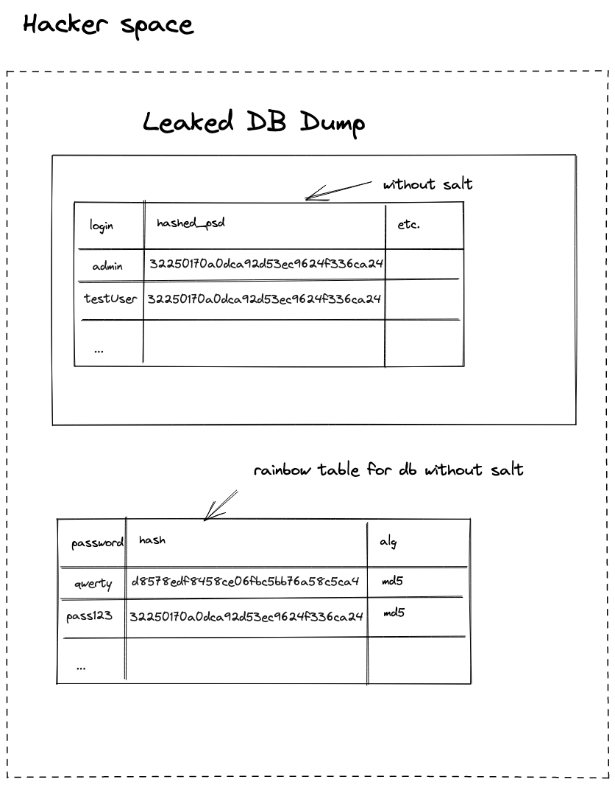

I created this short post to illustrate why you need unique password salt per user. In this post, I don't want to go into detail about [rainbow attack](https://en.wikipedia.org/wiki/Rainbow_table) or what is [salt in cryptography](https://en.wikipedia.org/wiki/Salt_(cryptography)). Let's start!

*Disclaimer: I used MD5 to generate hashes for simplicity, newer use it in production because it's too weak.*

## Login form
For now, you have two different users with the same passwords. Unfortunately, their passwords are very common, and you can probably find them in the attacker table with passwords and hashes.

## Password hashing without salt
If you use the approach to store the hash of the password and don't use salt: 
.

The attacker will need **0 minutes** to get your password from the hash as they already have a rainbow table with the most popular passwords.

## Password hashing without unique salt
If you use the approach to store the hash of the password and use the same salt for all users: 
.

The attacker will need **N minutes** to get your password from the hash as they can generate a rainbow table with your particular salt.

## Password hashing with unique salt
If you use the approach to store the hash of the password and you use the unique salt for each user: 
.

The attacker will need **N * K minutes** (where K is the number of users) to get your password from the hash, as they can generate a rainbow table for each salt.

## What to read
- https://en.wikipedia.org/wiki/Rainbow_table
- https://en.wikipedia.org/wiki/Salt_(cryptography)