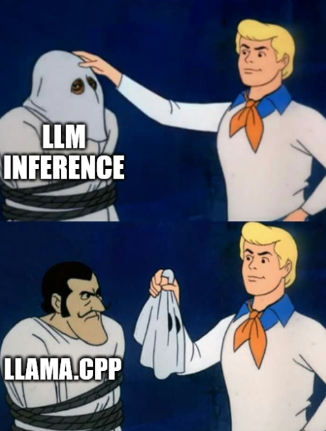

Due to LLM popularity at the moment, there are a lot of different tools for what seem to be very similar tasks — generating responses from the LLM and fine-tuning LLMs for your own needs. To understand this market better myself, I decided to write this post, summarizing knowledge that I already had and recently learned on the topic. All the information presented in the post is accurate as of April 2025 and may change, as the ecosystem around LLMs changes quickly.

## LLAMA.CPP
First, I want to mention llama.cpp, which is both used as a backend for some other popular tools and could be used on its own for user-friendly and high-throughput inference.

 
*Disclaimer: this is not true for ALL LLM inference tools, as some of them use custom backends or other backends such as TensorRT-LLM, but it is hard to highlight enough the importance of llama.cpp for the LLM inference ecosystem.*

| Tool          | License     | Open Source | Platforms                | Supported Models     |
|---------------|-------------|-------------|--------------------------|----------------------|
| llama.cpp     | MIT         | ✅ Yes      | Windows, Docker, macOS, Linux | GGUF models         |

Links:  
https://github.com/ggml-org/llama.cpp

## User-Friendly LLM Interfaces

These tools focus on user experience. Most come with GUIs, are relatively simple to install, and allow you to quickly start chatting with an LLM. Some also support fine-tuning and provide API access to local models. Many of these tools use llama.cpp or similar backends and are compatible with GGUF quantized models. Most are open source and support local inference, though multi-GPU support is usually limited or dependent on the backend used.

| Tool         | License     | Open Source | Platforms                  | Supported Models           | Backend Used          |
|--------------|-------------|-------------|----------------------------|----------------------------|-----------------------|
| LM Studio    | Commercial  | ❌ No       | Windows, macOS, Linux      | Various (GGUF and MLX), no image generation | Unconfirmed             |
| Ollama       | MIT         | ✅ Yes      | Windows, macOS, Linux      | https://ollama.com/library | llama.cpp             |
| GPT4All      | MIT         | ✅ Yes      | Windows, macOS, Linux      | 3–13B models               | llama.cpp             |
| AnythingLLM  | MIT         | ✅ Yes      | Windows, macOS, Linux      | Various via integrations   | Unconfirmed              |
| Jan          | AGPL-3.0    | ✅ Yes      | Windows, macOS, Linux      | https://cortex.so/models/  | cortex.cpp (supports configurable backends; default is llama.cpp) |

Links:  
https://lmstudio.ai/work  
https://ollama.com  
https://docs.gpt4all.io/gpt4all_desktop/models.html  
https://github.com/Mintplex-Labs/anything-llm  
https://github.com/menloresearch/jan  
https://cortex.so/models/

## Tools for High-Performance Inference

These tools are mostly used in production for high-performance inference and support quantization, batching, and other optimization techniques. Most of them provide Docker images as well.

| Tool        | License     | Open Source | Platforms       | Supported Models                                                  | Backend Used              |
|-------------|-------------|-------------|------------------|-------------------------------------------------------------------|---------------------------|
| TGI         | Apache 2.0  | ✅ Yes      | Docker, Linux   | https://huggingface.co/docs/text-generation-inference/supported_models | Supports several backends |
| vLLM        | Apache 2.0  | ✅ Yes      | Docker, Linux   | https://docs.vllm.ai/en/latest/models/supported_models.html      | Custom with PagedAttention|
| ExLlamaV2   | MIT         | ✅ Yes      | Linux           | Hugging Face models with exl2 postfix                             | Custom backend            |
| TensorRT-LLM| Apache 2.0  | ✅ Yes      | Linux           | https://nvidia.github.io/TensorRT-LLM/reference/support-matrix.html | PyTorch and TensorRT backends |

Links:  
https://github.com/turboderp-org/exllamav2  
https://blog.vllm.ai/2023/06/20/vllm.html  
https://github.com/huggingface/text-generation-inference  
https://huggingface.co/docs/text-generation-inference/multi_backend_support  
https://nvidia.github.io/TensorRT-LLM/torch.html

## Tools for High-Performance Fine-Tuning

These tools are used for fine-tuning, where you train models for your specific needs. They support quantization, multi-GPU setups, and different model families. They use different approaches for fine-tuning, such as a code-first approach with Unsloth or fine-tuning through configuration and command line with Torchtune.

| Tool       | License        | Open Source | Platforms      | Supported Models                                                |
|------------|----------------|-------------|----------------|-----------------------------------------------------------------|
| Unsloth    | Apache 2.0     | ✅ Yes      | Linux, Windows | https://docs.unsloth.ai/get-started/all-our-models              |
| Torchtune  | BSD 3 license  | ✅ Yes      | Linux          | https://github.com/pytorch/torchtune                           |
| Axolotl    | Apache 2.0     | ✅ Yes      | Linux          | https://github.com/axolotl-ai-cloud/axolotl                    |

Links:  
https://github.com/pytorch/torchtune  
https://unsloth.ai/introducing  
https://github.com/axolotl-ai-cloud/axolotl
