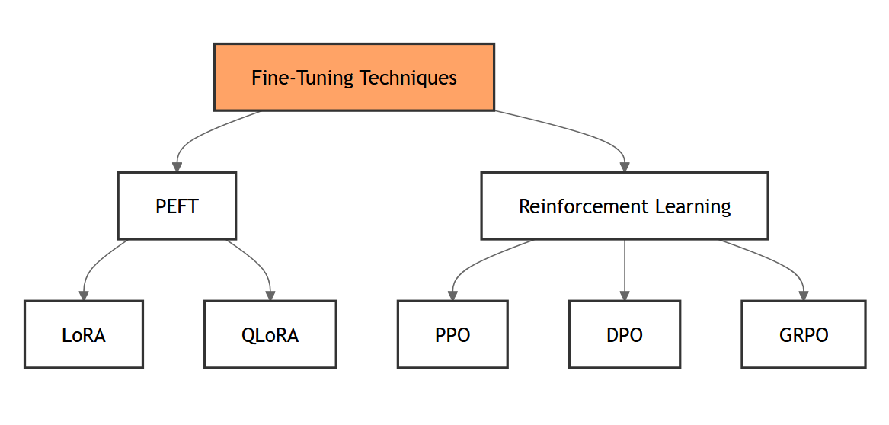

I decided to compile a list of terms/abbreviations that are often used around the machine learning and language model community when discussing tooling and techniques. I will reference this in my future posts to avoid repetition.

## Table of Contents

- [General Terms](#general-terms)
  - SOTA
  - Local LLM
  - VRAM
  - NLP and CV
  - TTS and STT
  - BPE and Byte-level BPE
  - 4-bit, 8-bit, and 16-bit

- [Terms Related to LLM Inference](#terms-related-to-llm-inference)
  - TPS
  - TtFT
  - RAG
  - GPTQ, AWQ, and EXL2
  - GGUF
  - GGML
  - GBNF
  - KV Cache

- [Related to LLM Fine-tuning](#related-to-llm-fine-tuning)
  - LoRA and QLoRA
  - PEFT
  - DPO, GRPO, PPO

## General Terms 
Here are terms that any AI enthusiast is probably aware of.

- **SOTA**  
  SOTA is "state of the art." When discussing LLMs, SOTA is often mentioned in the context of newly released models.

- **Local LLM**  
  Local large language models – small LLMs that can be run on your local computer or on services such as Google Colab or Kaggle. Usually, these LLMs require video memory that can be found on consumer hardware – between 8 and 24 GB of video memory.

- **VRAM**  
  VRAM – video memory on a GPU. It is often mentioned in relation to the size of the model you can use, as the larger the model, the more video memory it will require.

- **NLP and CV**  
  NLP (natural language processing) and CV (computer vision) are two areas of application for machine learning. NLP involves understanding and generation of text/human language, and CV includes everything related to processing and understanding visual information.

- **TTS and STT**  
  Text-To-Speech and Speech-To-Text – the processes of converting text to audio and vice versa.

- **BPE and Byte-level BPE**  
  Byte Pair Encoding (BPE) and Byte-level BPE are subword tokenization approaches that iteratively merge frequent pairs of characters or bytes to handle unknown words more effectively.

  Links:  
  https://huggingface.co/docs/transformers/en/tokenizer_summary

- **4-bit, 8-bit, and 16-bit**  
  Refers to numerical precision used to represent each weight (4, 8, or 16 in this case). The smaller the number, the less memory the model will require, but it will also may affect model accuracy.

  Links:  
  https://huggingface.co/docs/transformers/en/main_classes/quantization

## Terms Related to LLM Inference  
Inference is the process of generating output from a language model.

- **TPS**  
  Tokens Per Second – measures how many tokens a language model can generate per second.

- **TtFT**  
  Time to First Token – a latency metric that shows the amount of time it takes for a language model to produce the first token after receiving a prompt.

- **RAG**  
  Retrieval-Augmented Generation – allows a language model to check external databases or documents before generating text for the answer.

  Links:  
  https://aws.amazon.com/what-is/retrieval-augmented-generation/  
  https://arxiv.org/pdf/2005.11401

- **GPTQ, AWQ, and EXL2**  
  GPTQ (Gradient Post-Training Quantization), AWQ (Activation-aware Weight Quantization), and EXL2 (Extremely Low-bit format) – all three are quantization methods (with EXL2 also being a model format) that reduce model size and allow faster inference.

  Links:  
  https://oobabooga.github.io/blog/posts/gptq-awq-exl2-llamacpp/ – great post where the author benchmarks different quantization approaches

- **GGUF**  
  GGUF is a file format for working with language models. It is binary and single-file, where all information related to the model is stored in a single GGUF file.

- **GGML**  
  GGML is an older format used for running language models locally, now replaced by GGUF.

  Links:  
  https://github.com/ggml-org/ggml/blob/master/docs/gguf.md

- **GBNF**  
  GBNF (GGML Backus-Naur Form) is a format/grammar definition mechanism designed by llama.cpp that ensures the model returns output in a specific format according to GBNF rules. Later, OpenAI introduced a similar concept called Structured Output, where you can specify the format you want the LLM to respond in.

  Links:  
  https://github.com/ggml-org/llama.cpp/blob/master/grammars/README.md#gbnf-guide  
  https://openai.com/index/introducing-structured-outputs-in-the-api/

- **KV Cache**  
  Key-value caching that stores attention keys/values so the model does not recompute them every time during inference, improving speed. Optimizing how KV cache is stored can reduce GPU memory consumption during inference – for example, using the PagedAttention technique.

  Links:  
  https://blog.vllm.ai/2023/06/20/vllm.html

## Related to LLM Fine-tuning

Fine-tuning is the process of updating a pre-trained model for specific tasks.

- **LoRA and QLoRA**  
  LoRA (low-rank adaptation) and QLoRA (quantized low-rank adaptation) are optimization techniques for fine-tuning that allow reducing the number of training parameters by creating low-rank representations. QLoRA advances LoRA by also introducing 4-bit quantization, which reduces the amount of video memory needed for fine-tuning.

  Links:  
  https://arxiv.org/pdf/2106.09685v1/1000 – LoRA paper  
  https://proceedings.neurips.cc/paper_files/paper/2023/hash/1feb87871436031bdc0f2beaa62a049b-Abstract-Conference.html – original QLoRA paper

- **PEFT**  
  PEFT (Parameter-Efficient Fine-Tuning) is an umbrella term that covers methods such as LoRA and QLoRA, which train only a part of all model parameters during the fine-tuning process.

- **DPO, GRPO, PPO**  
  DPO (Direct Preference Optimization), GRPO (Generalized Rejection Sampling for Preference Optimization), and PPO (Proximal Policy Optimization) are reinforcement learning methods for LLM fine-tuning. PPO is an older approach, while DPO and GRPO are newer and more efficient. For example, GRPO was used for DeepSeek R1 model training, helping the model perform better on reasoning tasks.