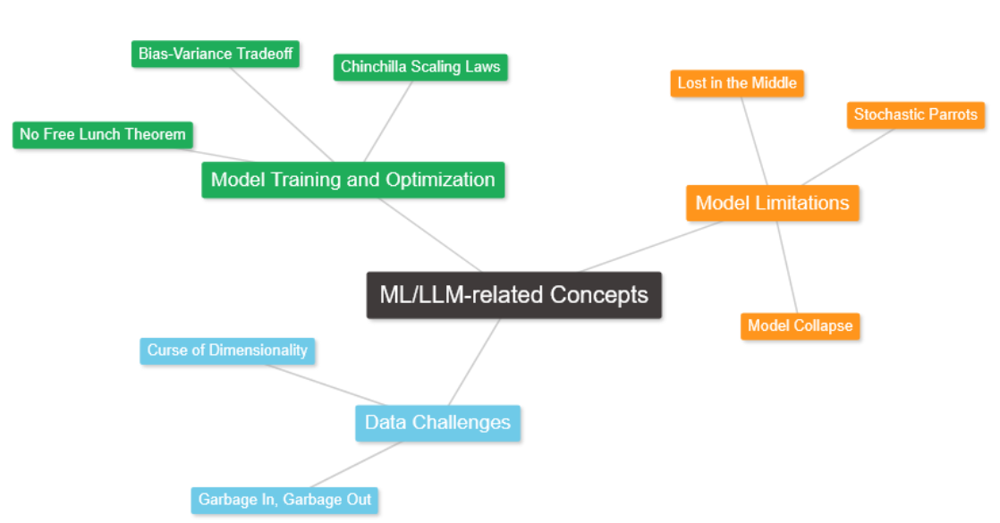

Talking about language models and machine learning in general, there is always some amount of jargon involved that was introduced in foundational papers or books. In this post I wanted to discuss the most popular ones that you can often find in the community discussions or in blogs similar to mine.

## Model Training and Optimization
- **No Free Lunch Theorem**  
It is probably the most popular and was first introduced by Wolpert et al. in the "No Free Lunch Theorems for Optimization." The main idea behind this is that, on average, any two optimization algorithms perform the same across all possible problems. To simplify, a specific optimization algorithm is better for a specific problem.

  Link:  
  https://homepages.uc.edu/~martinj/Philosophy%20and%20Religion/Arguments%20for%20the%20Existence%20of%20God/Teleology%20&%20Intelligent%20Design/Intelligent%20Design/Wolpert%20No%20Free%20Lunch.pdf - "No Free Lunch Theorems for Optimization."

- **Bias–Variance Tradeoff**  
Another popular ML concept that was introduced by Geman et al. in "Neural Networks and the Bias/Variance Dilemma." It is about balancing a model’s architecture and the size of the training dataset so that the final model has low bias (it captures patterns in the data well) and low variance (it is not too sensitive to data noise). You usually can’t minimize bias and variance at the same time, but you can balance them.

  Link:  
  https://citeseerx.ist.psu.edu/document?repid=rep1&type=pdf&doi=a34e35dbbc6911fa7b94894dffdc0076a261b6f0 - "Neural Networks and the Bias/Variance Dilemma."

- **Chinchilla Data-Optimal Scaling Laws**  
Chinchilla Law refers to LLM training and was introduced in the paper "Training Compute-Optimal Large Language Models." It discusses that, having a fixed compute budget, there is some "sweet spot" for the ratio of trainable parameters to the number of training tokens.

  Links:  
  https://arxiv.org/pdf/2203.15556 - "Training Compute-Optimal Large Language Models"  
  https://www.arxiv.org/pdf/2404.10102 - "Chinchilla Scaling: A Replication Attempt"

## Model Limitations
- **Lost in the Middle**  
"Lost in the Middle," in the context of language models, was introduced by Liu et al. in "Lost in the Middle: How Language Models Use Long Contexts." "Lost in the Middle" refers to the decrease in language model performance when dealing with larger messages and that peak understanding is at the beginning and the end of the long message. It is often mentioned when discussing newer models with large context sizes.

  Link:  
  https://arxiv.org/pdf/2307.03172 - "Lost in the Middle: How Language Models Use Long Contexts."

- **Stochastic Parrots**  
The concept of stochastic parrots in relation to language models was first introduced by Bender et al. in the paper "On the Dangers of Stochastic Parrots: Can Language Models Be Too Big?" It highlights that LLMs generate tokens based on probability and that they are trained on data which may contain harmful information or biases which the model can then repeat this information without truly comprehending/understanding its potential harm.

  Link:  
  https://dl.acm.org/doi/pdf/10.1145/3442188.3445922 - "On the Dangers of Stochastic Parrots: Can Language Models Be Too Big?"

- **Model Collapse**  
The term "model collapse" in relation to language models was introduced by Shumailov et al. in the paper "The Curse of Recursion: Training on Generated Data Makes Models Forget." This refers to the concept where LLMs trained on synthetic data degrade in the quality of the generated data. However, this is somewhat contradicted by other research, such as the paper "Textbooks Are All You Need," where the performance of the model was improved because of the training on synthetic data.

  Links:  
  https://files.antimattercloud.nl/the_curse_of_recursion.pdf  
  https://arxiv.org/abs/2306.11644

## Data Challenges
- **Curse of Dimensionality**  
The Curse of Dimensionality is a concept from mathematical theory, and in machine learning, it means that the more features (dimensions) your data has, the harder it becomes for the model to generalize from the data.

- **Garbage In, Garbage Out**  
Talking about data used for training machine learning models, people often refer to "Garbage In, Garbage Out." It means that it is crucial for an ML model to have high-quality training data that is properly preprocessed and has outliers removed.